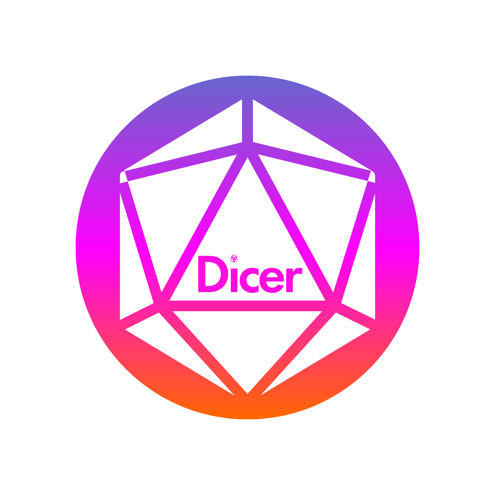

# Dicer
<p align="center">
  
</p>

Welcome to ***Dicer*** – the premier platform for tabletop RPG enthusiasts! 

Whether you're a player hunting for your next quest or a Dungeon Master seeking new adventurers for your campaign, Dicer connects you with like-minded people effortlessly.

Create your personalized profile by uploading your photo, selecting your class, and crafting a captivating bio. Share if you’re a player or DM, your preferred class or DM style, and a bit about your experience and unique skills or interests.

Seamlessly match with others and start planning your next epic adventure using our in-app chat or video chat. You can also filter matches by class for a more tailored experience. Plus, enjoy a sleek dark mode for a superior user experience.

Step into the world of tabletop RPGs with ***Dicer*** and let the adventures begin!


## Project Description
***Dicer*** is a web app that helps Players and Dungeon Master's connect with each other for future adventures!

## Features
* Match with Players and Dungeon Masters
* Filter Matches
* Peer-to-Peer Messaging
* Video Chat
* Profile Management
* Dark Mode


## Tech Stack
* PostgreSQL
* Express.js
* React
* Node.js


## Getting Started
#### Clone the repository

```sh
git clone git@github.com:nicoayamen/dicer.git
```

#### Create the `.env` File for Both Frontend and Backend
To set up the project, please follow the specific setup instructions in the respective directories:

- [Backend Setup Instructions](./backend/README.md)
- [Frontend Setup Instructions](./frontend/README.md)

#### Set up the Database
- [Database Setup Instructions](./backend/db/README.md)

#### Install dependencies for both frontend and backend
```
cd dicer

cd frontend
npm install

cd ../backend
npm install
```


####  Running the Development Servers
Backend

```cd backend
npm run local
```

Frontend
```cd frontend
npm start
```

## Dicer - Light Mode
Sign Up & Login


Profile


Edit Profile


Match


Chat & Video Chat


Delete Profile


## Dicer - Dark Mode
Sign Up & Login


Profile

Edit Profile


Match


Chat & Video Chat


Delete Profile


## Contributors

Thank you to all the contributors who have helped make this project great:

- [Kim O'Dell](https://github.com/kimodell)
- [Nicolas Ayala](https://github.com/nicoayamen)
- [Leilani Graham](https://github.com/oatmilkies)
- [Charley Smith-Schofield](https://github.com/charleysmithschofield)


##### Special Thanks to [Caitlyn Orsak](https://www.instagram.com/caitlynorsak/?hl=en) for her creation of our amazing Dicer logo!
