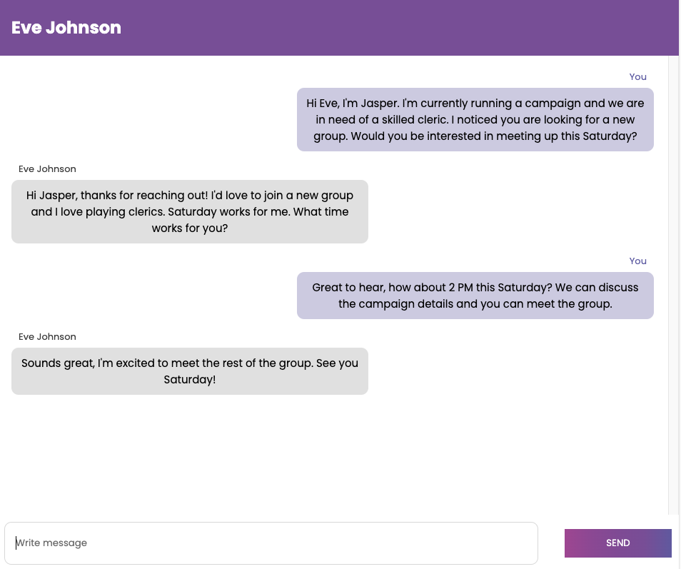

# Dicer

Welcome to ***Dicer*** – the premier platform for tabletop RPG enthusiasts! 

Whether you're a player hunting for your next quest or a Dungeon Master seeking new adventurers for your campaign, Dicer connects you with like-minded people effortlessly.

Create your personalized profile by uploading your photo, selecting your class, and crafting a captivating bio. Share if you’re a player or DM, your preferred class or DM style, and a bit about your experience and unique skills or interests.

Seamlessly match with others and use our in-app chat to start planning your next epic adventure. You can also filter matches by class for a more tailored experience. Plus, enjoy a sleek dark mode for a superior user experience.

Step into the world of tabletop RPGs with ***Dicer*** and let the adventures begin!


## Features
* Match with Players and Dungeon Masters
* Filter matches 
* Peer-to-peer messaging
* Profile management
* Dark Mode


## Tech Stack
* PostgreSQL
* Express.js
* React
* Node.js


## Getting Started
#### Clone the repository

```sh
git clone git@github.com:nicoayamen/dicer.git
```


#### Install dependencies for both frontend and backend
```
cd dicer

cd frontend
npm install

cd ../backend
npm install
```


####  Running the Development Servers
Backend

```cd backend
npm run local
```

Frontend
```cd frontend
npm start
```

## Dicer - Light Mode
Sign Up & Login


Profile


Edit Profile


Match


Chat 


Delete Profile


## Dicer - Dark Mode
Sign Up & Login


Profile

Edit Profile


Match


Chat


Delete Profile
